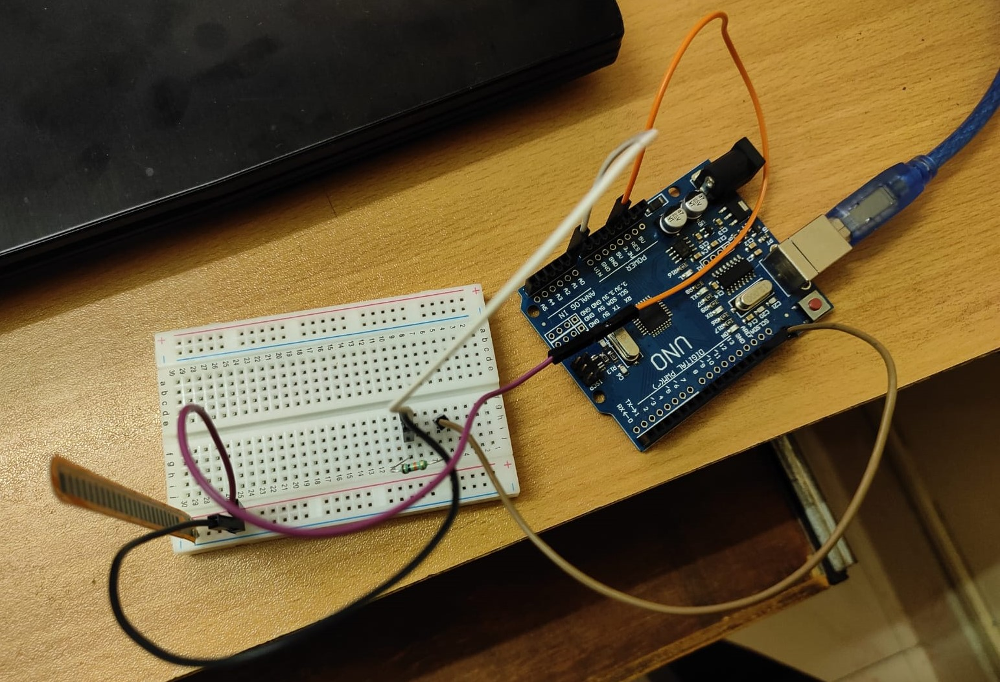

This repository contains a posture correction device and accompanying mobile app which provides real-time feedback.

- Hardware components:

  - Arduino UNO microcontroller
  - Flex sensor: to measure curvature of the spine
  - Ultrasonic sensor:to measure distance from the backrest
  - Bluetooth module: to wirelessly transmit the data

- The flex sensor and ultrasonic sensor are used to quantiatively measure the posture and the data is trasmitted from the Arduino UNO microcontroller to the mobile app via the bluetooth module.
- The mobile app, built using MIT app inventor, displays the details of one's posture in real time and displays warning if it exceeds the pre-determined values.
- Thus, this project can act as an accountability tool and gameify the experience of improving one's posture.

Demo:

